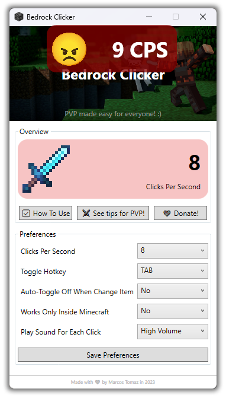

    
     
    Clone this repository and then copy the "Bedrock-Clicker-Compiled" folder to your computer. Read all the instructions below and then just enjoy!

# To use this Software

First, download this repository by cloning the "Bedrock-Clicker-Compiled" folder to your computer. After that, run the "Bedrock Clicker.exe" file present in "Bedrock-Clicker-Compiled/Bedrock Clicker/program/bin". You can move the "Bedrock Clicker" folder to somewhere you prefer on your computer. So just enjoy!

# Prerequisites to use this Software

You need to fulfill some requirements to be able to use this Software...

- The computer may need to have <a href="https://download.visualstudio.microsoft.com/download/pr/2d6bb6b2-226a-4baa-bdec-798822606ff1/9b7b8746971ed51a1770ae4293618187/ndp48-web.exe" target="_blank">.Net 4.8</a> installed in order to run the Software.
- The computer must be 64-bit.

# About this Software

Bedrock Clicker is an auto-clicker software created to make Minecraft Bedrock PVP easier and more democratic for everyone. This is without a doubt the best auto click for you who want to play Minecraft! It also has some really cool features like...

- Auto disable clicking on change weapon
- Can play sound for each click
- Show a overlay when clicking, to you know
- Can be configured to enable clicking only inside Minecraft
- Togglable Auto Sprint for Bedrock
- Crosshair add-on to facilitate Long Range Shooting with Bows
- and more!

This is software made for you who can't click as fast as some people, but would still like to play PVP in Minecraft. Inside the software, you will also find several tips to improve your PVP! Enjoy!

This project uses the library "RawInput.Sharp" to obtain the raw input from mouse device. You can refer to <a href="https://github.com/mfakane/rawinput-sharp" target="_blank">this</a> link for more details about the library.

This project uses the library "WpfAnimatedGif" to play GIFs on interface. You can refer to <a href="https://github.com/XamlAnimatedGif/WpfAnimatedGif" target="_blank">this</a> link for more details about the library.

# How to edit this Software

The source project of this Software is here in this repository as well. You can simply open the "Bedrock-Clicker-Source" folder with your Visual Studio IDE and edit the Software.

# Special Thanks

I would like to thank to "NirSoft" for developing the freeware "Keyboard State View" which allowed me to see the ID of some keys on the keyboard, which made it possible to add some Hotkeys to Bedrock Clicker functions. The "Keyboard State View" can also be used for debugging Bedrock Clicker in addition to discovering key IDs, so the "Keyboard State View" is also included in this repository, in the folder "Bedrock-Clicker-Keys-Viewer" for future use!

# Support projects like this

If you liked the Bedrock Clicker and found it useful for your, please consider making a donation (if possible). This would make it even more possible for me to create and continue to maintain projects like this, but if you cannot make a donation, it is still a pleasure for you to use it! Thanks! 😀

 

    

 

Created with ❤ by Marcos Tomaz

